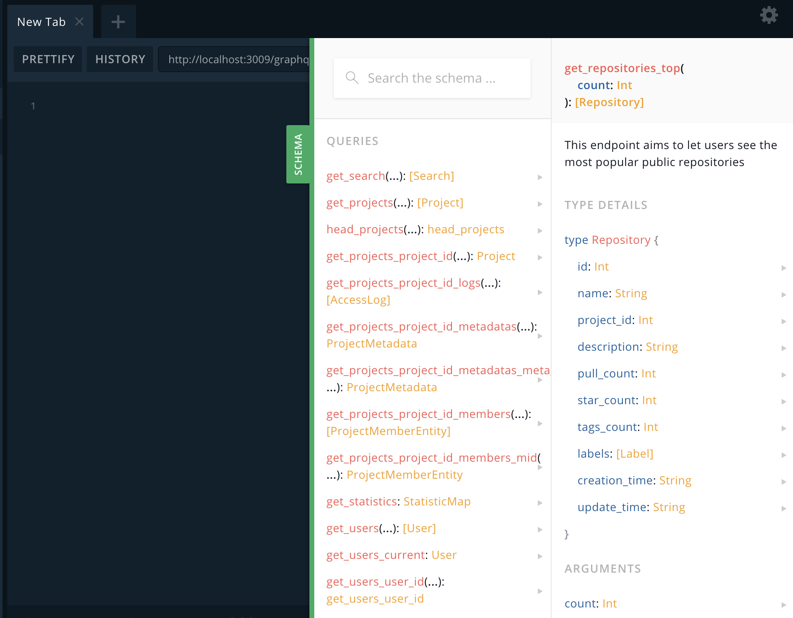

# swagger2graphql demo project

> this is a basic demo project for complex useage see below link

[swagger-to-graphql](https://github.com/yarax/swagger-to-graphql)

## How to Run(local)

* install deps

```code
yarn
```

* run

```code
yarn start
```

## Run with docker && docker-compose

* local build(docker-compose)

```code
docker-compose  up -d

open http://hostip:3009/graphql for search
```

* direct with build images

```code
docker run  -d -p 3009:3009 dalongrong/swagger-graphql

open http://hostip:3009/graphql for search
```

## some images

